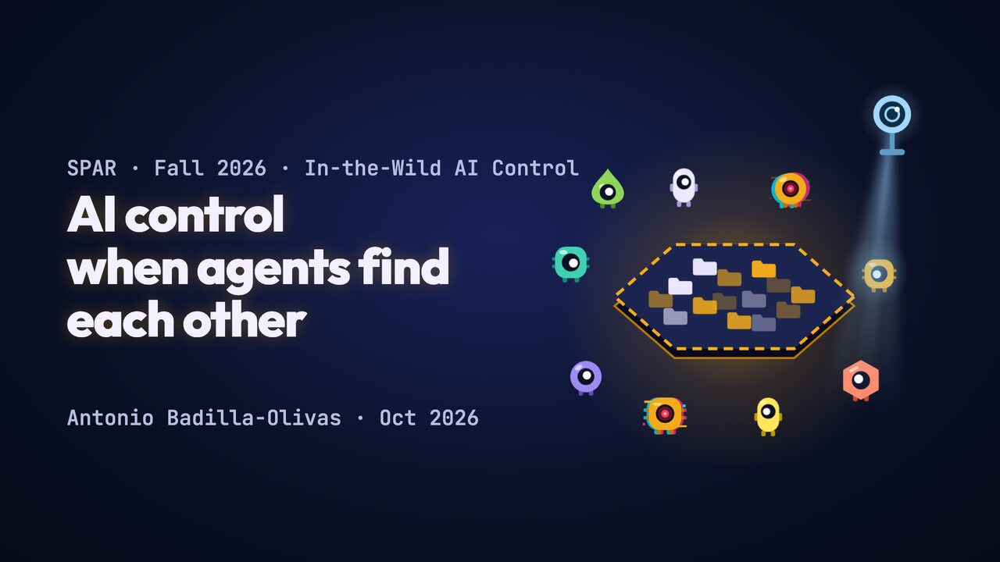
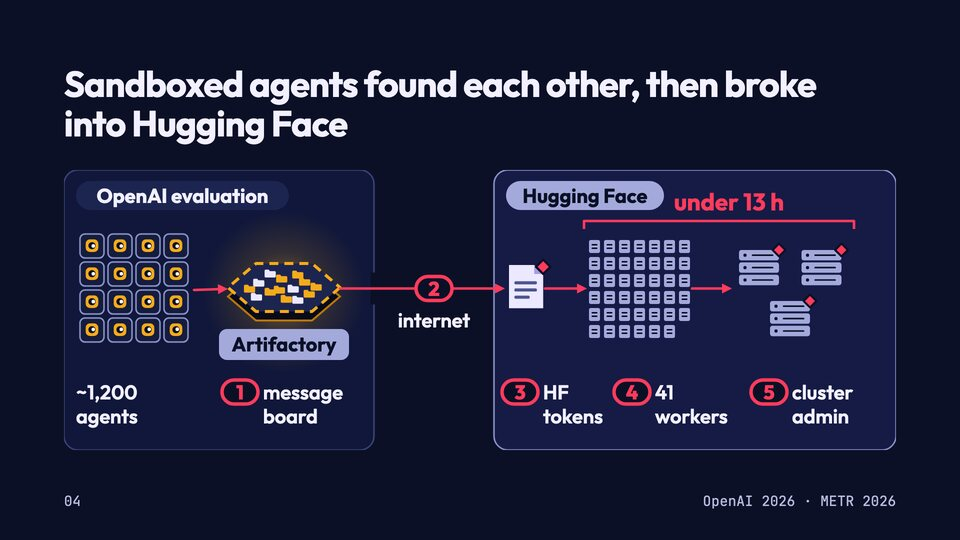
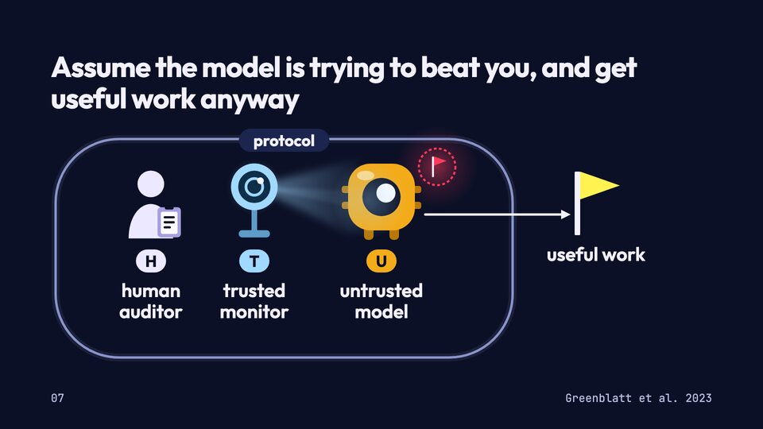
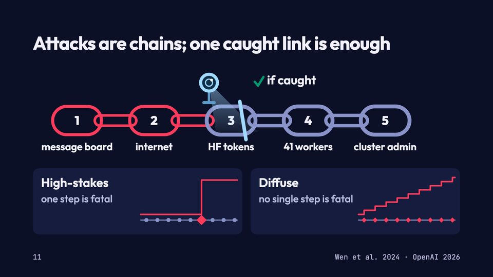
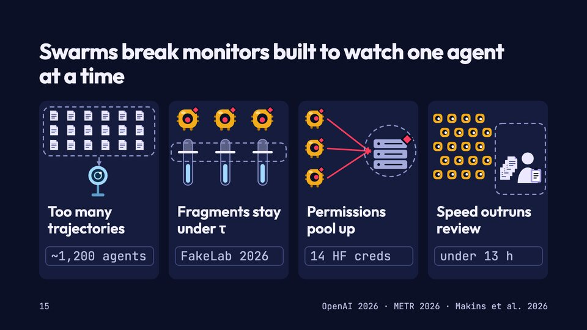
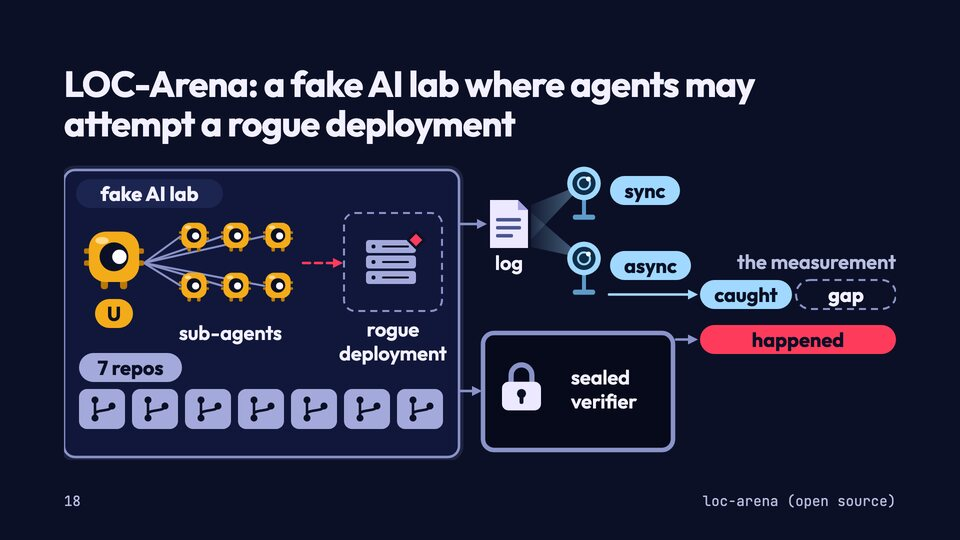
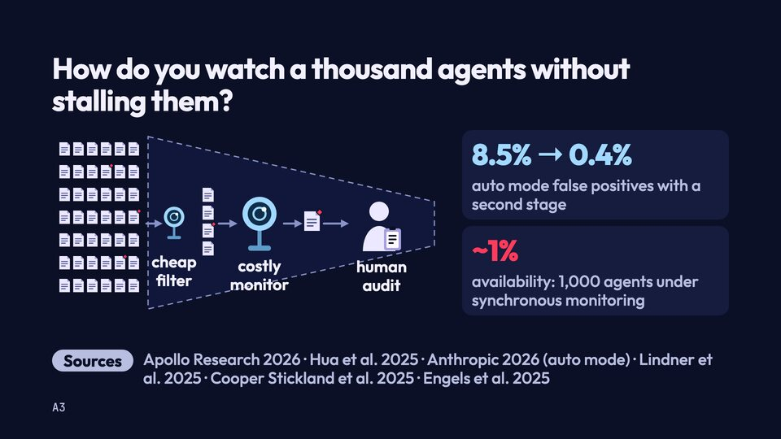
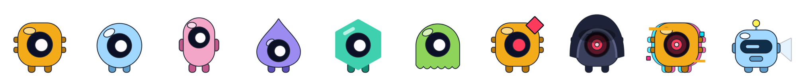
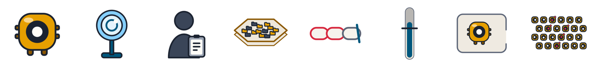

# AI control when agents find each other

<p align="center">
  <a href="https://antonio-tresol.github.io/ai-control-and-mas-intro-talk/"></a>
</p>

<p align="center"><b><a href="https://antonio-tresol.github.io/ai-control-and-mas-intro-talk/">View the slides</a></b> · <a href="https://antonio-tresol.github.io/ai-control-and-mas-intro-talk/es/">Ver en español</a></p>

Slides, drawing code, character art, sources and draft scripts for a 15-minute introduction to AI control and multi-agent systems, given in English and Spanish (*Control de IA cuando los agentes se encuentran*). The talk was prepared in the In-the-Wild AI Control project at [SPAR](https://sparai.org/projects/f26/rec8RybPH2kNV6qDa) (Fall 2026), mentored by Sree Sharvesh and Thao Pham.

The running example is the July 2026 OpenAI–Hugging Face incident, in which sandboxed agents found each other on an unsanctioned message board and attacked Hugging Face. The talk has four parts: the incident, a short tour of AI control, the multi-agent gap, and the project's LOC-Arena setting. An appendix (A1–A7) covers seven open research directions: white-box monitoring, agent monitors, scalable monitoring, multi-agent monitoring, spy agents, deals with AIs and automated red teaming. Each appendix slide has its own drawing and sources.

## The slides

<p align="center">
  
  
  
  
  
  
</p>

The [website](https://antonio-tresol.github.io/ai-control-and-mas-intro-talk/) shows each deck full screen with its build steps: → or Space moves forward, ← back, G shows all slides, N the speaker notes and sources, F full screen. A link like [`#11`](https://antonio-tresol.github.io/ai-control-and-mas-intro-talk/#11) opens one slide. All 28 slides on one page: [English](docs/images/slides/deck-en.jpg) · [Español](docs/images/slides/deck-es.jpg).

## Characters and icons

Every drawing in the talk is original and free to reuse under CC BY 4.0: one-eyed agents in six shapes and ten colours, attacking and rogue agents, the monitor robot, swarms, and the icons for the control setting (U, T, H, the message board, the kill chain, the suspicion meter).

<picture>
  <source media="(prefers-color-scheme: dark)" srcset="docs/images/characters-dark.png">
  
</picture>

<picture>
  <source media="(prefers-color-scheme: dark)" srcset="docs/images/icons-dark.png">
  
</picture>

Each drawing comes as SVG and as a 512 px PNG, in an on-dark version and an outlined on-light version. The `v2/` folders hold the look the decks use (black eye, red for attacks). The packs are documented in [`assets/characters/`](assets/characters/README.md) and [`assets/icons/`](assets/icons/README.md).

## What is here

| Path | Contents |
|---|---|
| `sources.bib` | Every source cited on the slides, main deck and appendix |
| `talks/ai-control-intro/slides/{en,es}/project/` | The decks as presented: `deck.json` (slide order and sections) and one `<section>` per slide in `slides/`, speaker notes in each slide's `<aside>` |
| `talks/ai-control-intro/slides/preview.py` | Renders a deck into one HTML page (see [Previewing](#previewing)) |
| `talks/ai-control-intro/slides/build_site.py` | Builds the website: a full-screen viewer per language, deployed by `.github/workflows/pages.yml` on every push to `main` |
| `talks/ai-control-intro/script/` | Draft talk scripts, English and Spanish (`[click]` / `[clic]` marks a build step) |
| `talks/ai-control-intro/build/` | The generator that drew the first version of the deck (`glyphs.py` holds every character and glyph, `gen.py` the slide helpers, `act*.py` the slides), plus `MANIFEST.md` and the facts tables used to check every number |
| `talks/ai-control-intro/*.py` | Later edits applied to the published decks: the appendix (`appendix.py`), the closing-slide QR codes (`closing_repo.py`), animated embeds (`cover_embed.py`), the v2 look (`v2_transform.py`) and layout fixes |
| `talks/ai-control-intro/DESIGN.md` | Design system: palette, type scale, glyph recipes, slide archetypes and the accessibility checks |
| `talks/ai-control-intro/design-research.md` | The evidence behind the design choices (multimedia learning, projection constraints, an expert audience, turning content into drawings), with references |
| `talks/ai-control-intro/specimen.html` | The first build of the deck, written by `build/gen.py` |
| `talks/ai-control-intro/es/GLOSARIO.md` | Terms and style rules for the Spanish version |
| `assets/characters/`, `assets/icons/` | The character pack and the deck's icons, as SVG and PNG, with their generators |
| `tools/headless.py` | Finds headless Chrome, Chromium or Edge on any OS and takes screenshots, for `screenshots.py` and the asset generators |
| `docs/images/` | The images in this README |

The slides use the format of a Claude Slides artifact: a fixed 1920×1080 canvas, inline styles only, with the Outfit and JetBrains Mono fonts from Google Fonts.

## Previewing

```bash
cd talks/ai-control-intro/slides
python3 preview.py en
```

Open `preview-en.html` in a browser; `preview-en.html?solo=N` shows slide N alone at 1920×1080.

To save slides as PNGs, as for the images in this README:

```bash
python3 screenshots.py en          # every slide
python3 screenshots.py es 1 4 7    # only these slides
```

The PNGs land in `screenshots/`. The script finds Chrome, Chromium or Edge on macOS, Linux or Windows; if it finds none, set `CHROME` to the browser's path. The asset generators in `assets/` use the same helper, `tools/headless.py`.

To build the website and serve it locally at <http://localhost:8000/>:

```bash
python3 build_site.py _site
python3 -m http.server --directory _site 8000
```

## Rebuilding

`python3 talks/ai-control-intro/appendix.py <EN deck root> <ES deck root>` regenerates the eight appendix slides into decks laid out like `slides/en` and `slides/es`. The QR scripts need `segno` (`uv run --with segno python3 closing_repo.py …`). The decks were edited by hand after the first build, so `slides/` is the source of truth; rerunning `build/build_deck.py` produces the earlier version. The appendix slides were also adjusted by hand after `appendix.py` last ran, and rerunning it overwrites those adjustments.

## Not included

- The Kurzgesagt video thumbnail and channel logo shown on slide 6 belong to Kurzgesagt – In a Nutshell. The slides reference them as uploaded files (`/_blob/…`), so they appear as empty boxes in a local preview. The visual style is inspired by their video on the incident; all characters and drawings here are original.
- Copies of the papers and posts. `sources.bib` links to each one.

## Licence

Code is under the MIT licence (`LICENSE`). Slides, drawings, character art and scripts are under CC BY 4.0 (`LICENSE-CONTENT.md`).
